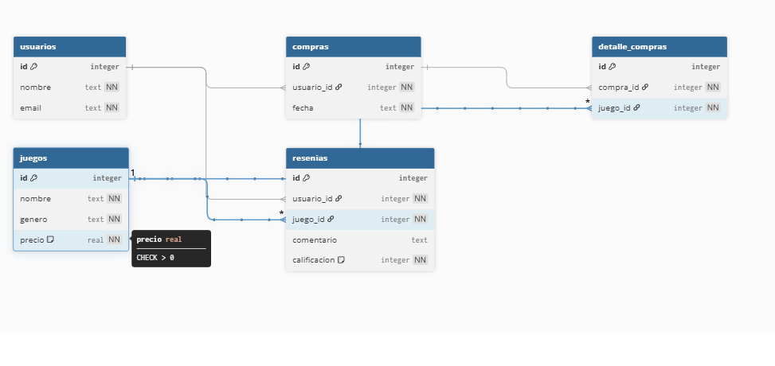

# 🎮 API REST — Sistema de Videojuegos

## 📌 Descripción del proyecto

Este proyecto consiste en el desarrollo de una API REST utilizando Node.js, Express y SQLite.
Permite gestionar usuarios, videojuegos, compras, detalles de compra y reseñas.

El sistema implementa operaciones CRUD completas, validaciones de datos, relaciones entre tablas mediante claves foráneas y un sistema de autenticación mediante middleware.

---

## 🌐 URL en producción

(Pegar aquí la URL de Render cuando la tengas)

```
https://tu-api.onrender.com
```

---

## 🔐 Autenticación

Todos los endpoints requieren el siguiente header:

```
password: 1234
```

---

## 🗄️ Modelo de datos (Diagrama ER)

A continuación se muestra el diagrama entidad-relación del sistema:



---

## 🧩 Tablas del sistema

* usuarios
* juegos
* compras
* detalle_compras
* reseñas

---

## 🔗 Relaciones

* Un usuario puede realizar muchas compras
* Una compra pertenece a un usuario
* Una compra puede tener varios juegos (detalle_compras)
* Un usuario puede hacer reseñas
* Un juego puede tener múltiples reseñas

---

## 🚀 Endpoints

### 👤 Usuarios

```
GET    /usuarios
GET    /usuarios/:id
POST   /usuarios
PUT    /usuarios/:id
DELETE /usuarios/:id
```

---

### 🎮 Juegos

```
GET    /juegos
GET    /juegos/:id
POST   /juegos
PUT    /juegos/:id
DELETE /juegos/:id
```

---

### 🧾 Compras

```
GET    /compras
GET    /compras/:id
POST   /compras
PUT    /compras/:id
DELETE /compras/:id
```

---

### 🔗 Detalle Compras

```
GET    /detalle
GET    /detalle/:id
POST   /detalle
PUT    /detalle/:id
DELETE /detalle/:id
```

---

### ⭐ Reseñas

```
GET    /resenias
GET    /resenias/:id
POST   /resenias
PUT    /resenias/:id
DELETE /resenias/:id
```

---

## 🧪 Ejemplo de uso

### Obtener todos los usuarios

```
GET /usuarios
```

### Crear un usuario

```
POST /usuarios
```

Body:

```json
{
  "nombre": "Juan",
  "email": "juan@email.com"
}
```

---

## ⚙️ Tecnologías utilizadas

* Node.js
* Express
* SQLite
* dotenv
* Nodemon

---

## 🧠 Validaciones implementadas

* Campos obligatorios (NOT NULL)
* Validación de tipos de datos
* Validación de unicidad (email)
* Validación de claves foráneas
* Restricciones CHECK en base de datos

---

## 🔐 Seguridad

* Middleware de autenticación global
* Uso de variables de entorno (.env)
* Exclusión de datos sensibles con .gitignore

---

## 💻 Instrucciones para ejecutar el proyecto localmente

### 1. Clonar repositorio

```
git clone https://github.com/tu-usuario/tu-repo.git
```

### 2. Instalar dependencias

```
npm install
```

### 3. Crear archivo .env

```
PORT=3000
API_PASSWORD=1234
```

### 4. Ejecutar en desarrollo

```
npm run dev
```

---

## 📊 Respuestas de la API

La API responde en formato JSON con códigos HTTP adecuados:

* 200 OK
* 201 Created
* 400 Bad Request
* 401
